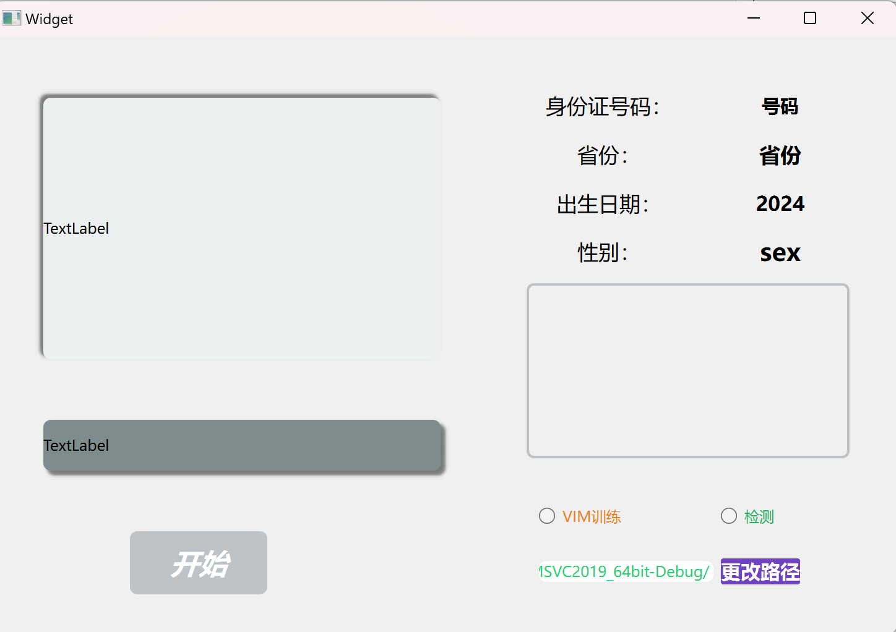
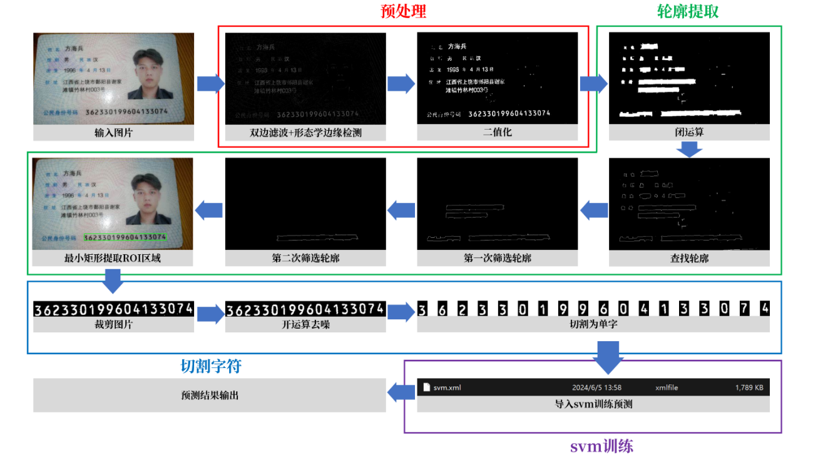
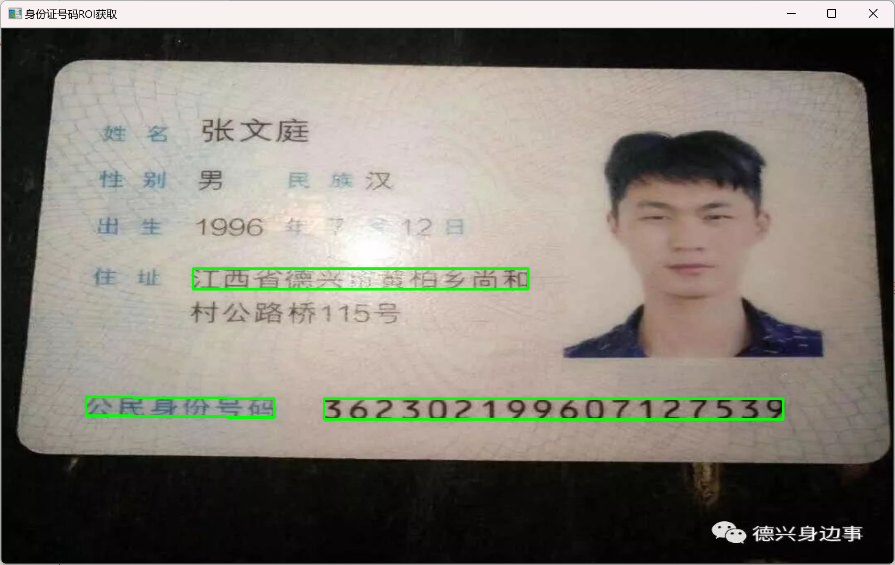
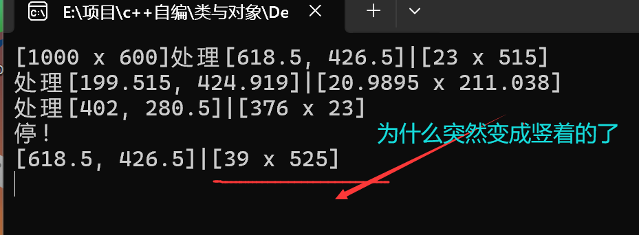

# 基于cv的身份证号码识别

这是一个基于c++和OpenCV的身份证号码识别，可以准确拿到身份证的号码，并将其和对应的省份进行比对，得到省份。根据号码判断是男是女，出生日期等功能。







# **文件路径**

> <!--递归搜索指定路径下的所有文件，包括所有子目录中的文件，并将它们的路径存储在向量中-->


```c++
void getFielNames(string path, vector<string>& files) {
	intptr_t hFile = 0;
	struct _finddata_t fileinfo;//io.h
	cout << "当前的文件路径：" << path << endl;
	string p;
    if ((hFile = _findfirst(p.assign(path).append("\\*").c_str(), &fileinfo)) != 0)
    {
        do
        {
            if ((fileinfo.attrib & _A_SUBDIR))//判断当前路径是否是一个文件夹----主要是SVM训练使用
            {
                if (strcmp(fileinfo.name, ".") != 0 && strcmp(fileinfo.name, "..") != 0)
                    getFielNames(p.assign(path).append("\\").append(fileinfo.name), files);
            }
            else
            {
                //文件的完整路径
                files.push_back(p.assign(path).append("/").append(fileinfo.name));
            }
        } while (_findnext(hFile, &fileinfo));//全部找出
        _findclose(hFile);
    }
}
```

## 代码的学习和使用

### 句柄 intprt_t

> ### 句柄 vs. 指针
>
> - **抽象级别**：
>   - **指针**：通常是内存地址的直接表示，指向内存中的某个具体位置。
>   - **句柄**：是一个抽象的标识符，由操作系统管理，用于代表一个资源。句柄背后的资源可能是文件、网络连接或其他系统资源，操作系统维护了句柄到资源的映射。
> - **安全性和封装**：
>   - **指针**：直接操作指针可能导致安全问题，如野指针、内存泄漏等。
>   - **句柄**：提供了一层封装，使得资源的管理更加安全。操作系统可以控制访问权限，防止未授权的访问，并且可以监控所有句柄的使用情况，从而有效管理资源。
> - **用途**：
>   - **指针**：主要用于指向内存中的数据结构或数组。
>   - **句柄**：用于操作和管理系统资源，如文件、数据库连接、进程等。
>
> ### 示例
>
> 以Windows操作系统中的文件操作为例，这里是句柄使用的具体流程：
>
> - 当程序请求打开一个文件时，操作系统会创建一个文件对象，并返回一个指向该文件对象的句柄。
> - 程序通过这个句柄进行读写操作。操作系统通过句柄识别对应的文件对象，并执行相应的操作。
> - 当程序完成对文件的操作后，可以调用关闭操作，告诉操作系统它可以回收与该句柄关联的资源。

```c++
intptr_t hFile = 0;
```

### struct _finddata_t

> 用于存储文件查找相关的信息。这个结构体通常在使用 `_findfirst` 和 `_findnext` 函数时使用，这些函数用于在文件系统中搜索匹配特定模式的文件

> _findfirst() 是一个在Windows环境下用于查找目录中的第一个文件的函数。它返回一个句柄（在这里赋值给 hFile），这个句柄用于识别开启的搜索序列，随后可以用于 _findnext() 函数中，继续查找更多文件。如果 _findfirst() 找不到任何文件或发生错误，它通常返回 -1 
>
> - 使用 `_findfirst()` 开始一个文件搜索，并获取一个句柄。
> - 使用该句柄调用 `_findnext()` 继续搜索更多文件。
> - 搜索完成后，应使用 `_findclose()` 关闭句柄，释放资源。

```c++
hFile = _findfirst(p.assign(path).append("\\*").c_str(), &fileinfo)
```

> ### 参数解释
>
> - `p.assign(path).append("\\*").c_str()`: 这个表达式构建了一个搜索路径。首先，它将字符串 `path` 赋给字符串变量 `p`，然后附加 `"\*"`（意味着选择目录下的所有文件和子目录），最后通过 `c_str()` 转换为C风格的字符串。这样做是为了创建一个表示目录中所有文件的路径字符串，用于搜索操作。
> - `&fileinfo`: 这是一个指向 `_finddata_t` 结构的指针，该结构在搜索过程中用来存储每个找到的文件的信息，如文件名、大小、时间戳等。

### attrib  & _A_SUBDIR属性判断

​				attrib 是其中的一个成员，表示文件的属性。

​				_A_SUBDIR: 这是一个常量，表示文件属性中的“目录”标志。它通常在头文件 io.h 中定义

### strcmp函数

c语言的字符串比较，这里的目的：进行目录遍历时，用来检查当前处理的文件或目录名称是否不是这两个特殊条目的表达式

```c++
if (strcmp(fileinfo.name, ".") != 0 && strcmp(fileinfo.name, "..") != 0)//不在当前目录，也不在上级目录
```

# SVM模型训练

> 模型训练，就是打标，让机器学习的过程，这个不必多说了，哈哈

```c++
void Card::setTrain_SVM()
{
	cout << "这里是训练SVM函数" << endl;
	cout << "---------开始SVM的训练-----------" << endl;
	//要训练svm
	

	TickMeter trainTime;//记录训练时间
	trainTime.reset();
	trainTime.start();
	
	Mat trainImages;	//训练数据图片
	vector<int> trainLabels;//打标---无需多言
	Mat img_svm;
	Ptr<SVM>svm;
	
	//初始化
	svm = SVM::create();
	svm->setType(SVM::C_SVC);
	svm->setTermCriteria(TermCriteria(TermCriteria::MAX_ITER, 100, 1e-6));
	
	//int classes[]={0,1,2,3,4,5,6,7,8,9,10}目前没有部分数据集，训练不了
	int classes[] = { 0, 2, 3, 4, 6, 7, 8, 9 };
	
	vector<string> files;
	
	//读取文件
	for (auto x : classes)		//每一个文件夹里面训练所有图片
	{
		for (auto file : files) 
		{
			cout << "当前要训练的文件为：" << file;
			img_svm = imread(file, 0);//读取灰度图
			if (img_svm.empty())
			{
				cout << "\t该文件为空,跳过！" << endl;
				continue;
			}
			threshold(img_svm, img_svm, 10, 255, THRESH_OTSU);//二值化
			img_svm.convertTo(img_svm, CV_32FC1);//转化通道类型
	
			trainImages.push_back(img_svm.reshape(0, 1));//矩阵转化为单行 100*100->1*10000
			trainLabels.push_back(x);//该图片对应的数据集标记一起对应加进去
		}
		files.clear();		//清空，遍历下一个数据
	}
	
	//进行训练
			训练样本的特征向量|每一行是一个训练样本|训练样本的类别标签
	svm->train(trainImages, ROW_SAMPLE, trainLabels);
	svm->save("./data / res /svm2.xml");
	svm->clear();
	trainTime.stop();
	cout << "-------------SVM训练结束----------------" << endl;
	cout << "本次训练时间：" << trainTime.getTimeSec() << "s" << endl;;

}
```

## SVM步骤

```c++
	Mat trainImages;	//训练数据图片
	vector<int> trainLabels;//打标---无需多言
	Mat img_svm;	//读取用来准备训练的图片
	Ptr<SVM>svm;	//svm实例化，智能指针
	
	//初始化
	svm = SVM::create();
	svm->setType(SVM::C_SVC);
	svm->setTermCriteria(TermCriteria(TermCriteria::MAX_ITER, 100, 1e-6));
	
	trainImages.push_back(img_svm.reshape(0, 1));
	trainLabels.push_back(x);
	
	//进行训练
	svm->train(trainImages, ROW_SAMPLE, trainLabels);
	svm->save("./ data / res /svm2.xml");
	svm->clear();
	trainTime.stop();
```

# 图像预处理

> 对刚读取的图片进行一些预处理，方便身份证号码那块的区域的筛选和提取

## 基操：双边滤波|灰度化|形态学边缘检测|二值化

```c++
//函数预处理
void Card::preDeal()
{
	//双边滤波
	bilateralFilter(idcard, img, 7, 10, 5);				// 双边滤波
	namedWindow("双边滤波", WINDOW_NORMAL);
	imshow("双边滤波", img);

	//灰度化
	cvtColor(img, img, COLOR_BGR2GRAY);//灰度化
	imshow("灰度化", img);

	// 形态学边缘检测
														//连接图像中的断裂部分或者关闭小的空洞;
														// 矩形结构元素，尺寸为 7x7
	Mat tmp = img.clone();								// 临时存储空间
	morphologyEx(										// 形态学运算
		img,											// 输入图像
		tmp,											// 输出图像
		MORPH_CLOSE,									// 指定闭运算 连通破碎区域
		getStructuringElement(MORPH_RECT, Size(7, 7))	// 获取结构核
	);
	img = tmp - img;		// 作差得到边缘信息
	imshow("形态学边缘检测", tmp);
	imshow("形态学边缘检测作差", img);
	tmp.release();

	//二值化
	threshold(img, img, 0, 255, THRESH_OTSU);	//OTSU 方法自动确定最优阈值进行二值化->包含黑白图
	imshow("二值化", img);
}
```

# 号码特定区域提取ROI

> 因为身份证号码肯定是一些字，如果前面预处理没有问题的话，那么二值化过后，会很明显的显示出来，对这些明显的地方进行筛选，得到包围身份证号码的长条矩形

```c++
void Card::detect_ROI()
{
	// 闭运算 形成连通区域
	morphologyEx(										// 形态学运算
		img,											// 输入图像
		img,											// 输出图像
		MORPH_CLOSE,									// 指定闭运算 连通号码区域
		getStructuringElement(MORPH_RECT, Size(21, 13))	// 获取结构核
	);
	imshow("闭运算", img);
    
	// 查找轮廓
	vector<vector<Point>> contours;						// 保存轮廓点
	vector<Vec4i> hierarchy;							// 轮廓的层级关系
	findContours(										// 查找轮廓
		img,											// findContours 会改变输入图像
		contours,										// 输出轮廓
		hierarchy,										// 层级关系 此处只需一个占位
		RETR_TREE,										// 树形式保存
		CHAIN_APPROX_NONE								// 存储所有的轮廓点，不进行压缩轮廓点
	);
	img.release();										// 清空 img 占用的内存
	vector<Vec4i>().swap(hierarchy);					// 清空 hierarchy 占用的内存
	
	Mat dbg_img = Mat::zeros(idcard.size(), CV_8UC1);	//创建等大空白区域
	for (int dbg_i = 0; dbg_i < contours.size(); dbg_i++) {
		drawContours(dbg_img, contours, dbg_i, 255, 1, 8);//将轮廓点修饰上去
	}	
	imshow("查找所有轮廓", dbg_img);
	dbg_img.release();
	
	// 筛选轮廓
	vector<vector<Point>> contours_number;				// 保存可能的号码区域
	for (auto itr = contours.begin(); itr != contours.end(); itr++)
		if (itr->size() > 400)							// 保留轮廓点数多于 400 的
			contours_number.push_back(*itr);			// 保存该轮廓
	vector<vector<Point>>().swap(contours);				// 释放 contours 占用的内存
	//显示筛选过后的图像样子
	Mat dbg_im = Mat::zeros(idcard.size(), CV_8UC1);
	for (int dbg_i = 0; dbg_i < contours_number.size(); dbg_i++)
		drawContours(dbg_im, contours_number, dbg_i, 255, 1, 8);
	imshow("轮廓进行筛选减少", dbg_im);
	dbg_im.release();
	
	//最小包围矩阵框
	for (auto itr = contours_number.begin(); itr != contours_number.end(); itr++)
	{
		RotatedRect rotatedRect = minAreaRect(*itr);	//从点集求出最小包围矩形|旋转不用水平对齐
		const float width = rotatedRect.size.width;		//长
		const float height = rotatedRect.size.height;	//宽
		const float k = height / width;					//比值
		if (width < 15 || height < 15 || (0.1 < k && k < 10))		//矩形形状小而且不是大长条
			continue;
		rotateRects.push_back(rotatedRect);
	}
	vector<vector<Point>>().swap( contours_number);
	
	if (rotateRects.empty())	
        cout << "身份证号码区域提起为空！" << endl;
	else
	{
		Point2f dbg_p[4];
		Mat dbg_img = idcard.clone();
		for (auto dbg_rotatedRect : rotateRects)
		{
			dbg_rotatedRect.points(dbg_p);
			for (int dbg_i = 0; dbg_i < 4; dbg_i++)
				// 绘制图像		起点		终点永远是起点
				line(dbg_img, dbg_p[dbg_i], dbg_p[(dbg_i + 1) % 4], Scalar(0, 0, 255), 2, 8);
		}
		imshow("身份证号码ROI获取", dbg_img);
	}
}
```

## 形态学闭运算

```c++
morphologyEx(										// 形态学运算
		img,											// 输入图像
		img,											// 输出图像
		MORPH_CLOSE,									// 指定闭运算 连通号码区域
		getStructuringElement(MORPH_RECT, Size(21, 13))	// 获取结构核
	);
```

## 轮廓查找

```c++
// 查找轮廓
	vector<vector<Point>> contours;		// 保存轮廓点|
	vector<Vec4i> hierarchy;			// 轮廓的层级关系
	findContours(						// 查找轮廓
		img,							// findContours 会改变输入图像
		contours,						// 输出轮廓
		hierarchy,						// 层级关系 此处只需一个占位
		RETR_TREE,						// 树形式保存
		CHAIN_APPROX_NONE				// 存储所有的轮廓点，不进行压缩轮廓点
	);
```

**vector<vector<Point>> contours**：每个物体的轮廓点都存储在一个 `vector<Point>` 中，所有的轮廓点集合构成 `contours`

## 最小包围矩形

```c++
for (auto itr = contours_number.begin(); itr != contours_number.end(); itr++)
	{
		RotatedRect rotatedRect = minAreaRect(*itr);	//从点集求出最小包围矩形|旋转不用水平对齐
		const float width = rotatedRect.size.width;		//长
		const float height = rotatedRect.size.height;	//宽
		const float k = height / width;					//比值
		if (width < 15 || height < 15 || (0.1 < k && k < 10))		//矩形形状小而且不是大长条
			continue;
		rotateRects.push_back(rotatedRect);
	}
```

# 切割成单个ROI区域

> 想法：通过对轮廓的个数获取，从而判断身份证号码的区域|或者直接对其进行18等分

```c++
void Card::num_id()
{
	//提取到的区域包括了号码在的，也有其他的，先想去掉
    //然后就是不清楚为什么横的变竖了
	Mat temp;
	vector<vector<Point>> contours;//存储轮廓
	for (auto itr = rotateRects.begin(); itr != rotateRects.end(); itr++)//对这些矩形一个一个的进行筛查
	{
		Size newSize (itr->size.width +16, itr->size.height +10);//稍微把区域放大一点
		getRectSubPix(num_img, newSize, itr->center, temp);
		imshow("裁剪图片", temp);
        
		// 使用形态学开运算去除小的噪声点
		Mat element = getStructuringElement(MORPH_RECT, Size(3, 3)); // 创建一个3x3的结构元素
		morphologyEx(temp, temp, MORPH_OPEN, element); // 执行开运算
		imshow("去噪后的图片", temp);
		
		//对区域进行轮廓查找
		findContours(temp, contours, RETR_EXTERNAL, CHAIN_APPROX_NONE);//查找轮廓

		if (contours.size() == 18)//是18个轮廓才是号码区域
		{
			break;
		}
	}
	vector<RotatedRect>().swap(rotateRects);//找到要的区域，之前的矩形没用了
	if (contours.size() != 18)
	{
		cout << "！！！没有找到身份证号码在的区域num_id" << endl;
	}

	//输出是乱序，没有按顺序排列
	//-------------排序-----------------
	sort(contours.begin(), contours.end(), [](vector<Point>l, vector<Point>r) {
		return boundingRect(l).br().x < boundingRect(r).br().x;
		});
	//--------------------------------
	string n_self = "身份证号码第";
	int n_selfi = 1;
	for (auto itr = contours.begin(); itr != contours.end(); itr++, n_selfi++)
	{
		Rect rect = boundingRect(*itr);	//单个数字
		Mat temp_img = temp(Rect(rect)).clone();
		imshow(n_self + to_string(n_selfi), temp_img);
		cv::resize(temp_img,temp_img, Size(28, 28));
		numbers.push_back(temp_img);
	}
}
```

### 横着的矩形变竖着的了



#### 方法就是，如果它是竖着的，那我强行给它转正了

```c++
cout << "width：" << itr->size.width;
cout << "height：" << itr->size.height;
if ((itr->size.width) < (itr->size.height))
{
	double t = itr->size.width;
	itr->size.width = itr->size.height;
	itr->size.height = t;
    cout << "width：" << itr->size.width;
	cout << "height：" << itr->size.height;
}		
Size newSize(itr->size.width + 16, itr->size.height + 10);
getRectSubPix(num_img, newSize, itr->center, temp);
imshow("裁剪图片", temp);
```


## 取出每一个数字

```c++
for (auto itr = contours.begin(); itr != contours.end(); itr++, n_selfi++)
	{
		Rect rect = boundingRect(*itr);	//单个数字
		Mat temp_img = temp(Rect(rect)).clone();
		imshow(n_self + to_string(n_selfi), temp_img);
		cv::resize(temp_img,temp_img, Size(28, 28));
		numbers.push_back(temp_img);
	}
```

得到轮廓的最小包围矩形：`Rect rect = boundingRect(*itr);`	|一个数字的小矩形

在temp这个图像里面，定位这个矩形：`temp(Rect(rect))`  再复制一份交给temp_img

复制一份的原因：得到一份全新的，如果不复制，直接得到原图的地址，避免对原图进行更改

## 数字矩形是乱序的

> 不清楚什么原因，这个轮廓的记录好像不是从左到右的，所有必须进行排序

```c++
sort(contours.begin(), contours.end(), [](vector<Point>l, vector<Point>r) {
		return boundingRect(l).br().x < boundingRect(r).br().x;
		});
```

**从左向右排列轮廓的中心位置**，再进行切割，这样我们就能得到有序的号码区域

然后里面使用了一个lambda表达式，这个是看出来了的

> 该比较函数接收两个`vector<Point>`类型的参数`l`和`r`，分别表示要比较的两个轮廓。
>
> `boundingRect(r).br().x`获取轮廓`r`的边界矩形的右下角点的x坐标

具体可以联系邮箱：libai9123@outlook.com

2024.6				大一下编程作业